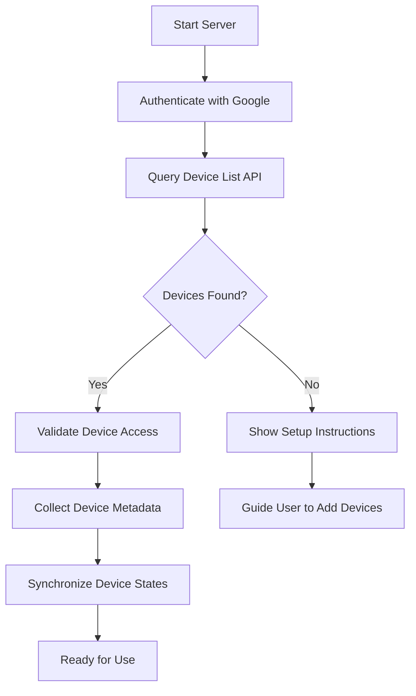

# Nest Protect MCP Setup Guide

This guide will walk you through setting up the Nest Protect MCP server with real Nest Protect devices.

**Quick reference:** For a short auth-focused guide (refresh token, .env, troubleshooting), see [AUTH_SETUP.md](AUTH_SETUP.md). The webapp also has an **Setup & auth** onboarding page and Help modal with the same steps.

## Table of Contents
1. [Prerequisites](#prerequisites)
2. [Google Cloud Project Setup](#google-cloud-project-setup)
3. [OAuth 2.0 Credentials](#oauth-20-credentials)
4. [Nest Protect Device Types](#nest-protect-device-types)
5. [Configuration](#configuration)
6. [Running the Server](#running-the-server)
7. [Troubleshooting](#troubleshooting)

## Prerequisites

- Python 3.10 or higher
- A Google account
- One or more Nest Protect devices connected to your Nest/Google Home account
- Basic familiarity with command line and Python

## Google Cloud Project Setup

1. Go to the [Google Cloud Console](https://console.cloud.google.com/)
2. Click on the project dropdown and select "New Project"
3. Enter a project name (e.g., "Nest Protect MCP") and click "Create"
4. Once created, make sure the project is selected in the top navigation bar

## Enable Required APIs

1. In the Google Cloud Console, navigate to "APIs & Services" > "Library"
2. Search for "Smart Device Management API" and click on it
3. Click "Enable"
4. Search for "OAuth Consent Screen" and click on it
5. Select "External" user type and click "Create"
6. Fill in the required information (app name, user support email, developer contact email)
7. Click "Save and Continue"
8. Add the following scopes:
   - `https://www.googleapis.com/auth/sdm.service`
   - `https://www.googleapis.com/auth/pubsub`
9. Click "Save and Continue"
10. Add test users (your Google account email)
11. Click "Save and Continue" then "Back to Dashboard"

## Comprehensive API Key Setup & Authentication

### OAuth 2.0 Credentials Configuration

#### **Step 1: Create OAuth Client ID**
1. Navigate to [Google Cloud Console](https://console.cloud.google.com/)
2. Go to **APIs & Services** → **Credentials**
3. Click **"+ CREATE CREDENTIALS"** → **OAuth client ID**
4. Select **"Desktop application"** as application type
5. Enter name: `"Nest Protect MCP Server"`
6. Click **"CREATE"**
7. **⚠️ IMPORTANT**: Download the JSON file immediately - it contains your Client Secret
8. Store the downloaded `client_secret_*.json` file securely

#### **Step 2: Extract Client Credentials**
From the downloaded JSON file, extract:
```json
{
  "client_id": "your-client-id.apps.googleusercontent.com",
  "client_secret": "your-client-secret"
}
```

#### **Step 3: Obtain Refresh Token**

**Option A: Automated Script (Recommended)**
```bash
# Install required package
pip install google-auth-oauthlib requests

# Create the token script
cat > get_refresh_token.py << 'EOF'
import json
from google_auth_oauthlib.flow import InstalledAppFlow

# Load credentials from downloaded JSON
with open('client_secret_*.json', 'r') as f:
    creds = json.load(f)

CLIENT_CONFIG = {
    "installed": {
        "client_id": creds["client_id"],
        "client_secret": creds["client_secret"],
        "auth_uri": "https://accounts.google.com/o/oauth2/auth",
        "token_uri": "https://oauth2.googleapis.com/token",
        "auth_provider_x509_cert_url": creds.get("auth_provider_x509_cert_url", "https://www.googleapis.com/oauth2/v1/certs"),
        "redirect_uris": ["urn:ietf:wg:oauth:2.0:oob", "http://localhost"]
    }
}

flow = InstalledAppFlow.from_client_config(
    CLIENT_CONFIG,
    scopes=['https://www.googleapis.com/auth/sdm.service']
)

# This will open a browser for authentication
creds = flow.run_local_server(port=8080)

print("🎉 Authentication successful!")
print(f"🔑 Refresh Token: {creds.refresh_token}")
print("💡 Save this refresh token securely - you'll need it for the MCP server")
EOF

# Run the script
python get_refresh_token.py
```

**Option B: Manual Browser Flow**
If the automated script fails:
1. Visit: `https://accounts.google.com/o/oauth2/auth?client_id=YOUR_CLIENT_ID&redirect_uri=urn:ietf:wg:oauth:2.0:oob&scope=https://www.googleapis.com/auth/sdm.service&response_type=code`
2. Sign in with your Google account
3. Grant permissions for "Smart Device Management"
4. Copy the authorization code
5. Exchange for tokens using the API

#### **Step 4: Configure Environment Variables**
Create a `.env` file in your project root:
```bash
# Nest API Credentials
NEST_CLIENT_ID=your-client-id.apps.googleusercontent.com
NEST_CLIENT_SECRET=your-client-secret
NEST_PROJECT_ID=your-google-cloud-project-id
NEST_REFRESH_TOKEN=your-refresh-token-from-step-3

# Optional: Server Configuration
HOST=0.0.0.0
PORT=8000
LOG_LEVEL=INFO
```

### Authentication Security Best Practices

#### **🔐 Credential Storage**
- **Never commit** `.env` files to version control
- Use **environment variables** in production
- Rotate refresh tokens **every 6 months**
- Store secrets in **secure key management** systems

#### **🔑 Token Management**
- **Refresh tokens** are long-lived (valid for 6 months)
- **Access tokens** expire after 1 hour
- Server **automatically refreshes** tokens
- Monitor token expiration in logs

#### **🛡️ Security Checklist**
- [ ] Client Secret never exposed in logs
- [ ] Refresh token stored securely
- [ ] HTTPS used for all API calls
- [ ] OAuth scopes limited to required permissions
- [ ] Regular credential rotation policy
- [ ] Audit logging enabled for authentication events

### Troubleshooting Authentication Issues

#### **"invalid_client" Error**
```
Error: invalid_client
```
**Solution**: Verify Client ID and Secret are correct and not swapped

#### **"access_denied" Error**
```
Error: access_denied
```
**Solution**: Ensure your Google account has Nest devices and Smart Device Management API access

#### **"invalid_scope" Error**
```
Error: invalid_scope
```
**Solution**: Verify the scope `https://www.googleapis.com/auth/sdm.service` is included

#### **Token Expired**
```
Error: invalid_grant
```
**Solution**: Re-run the OAuth flow to get a new refresh token

#### **Rate Limiting**
```
Error: rate_limit_exceeded
```
**Solution**: Implement exponential backoff, reduce request frequency

## Nest Protect Device Types & Hardware

### Comprehensive Hardware Specifications

#### **Nest Protect (2nd Generation)**
- **Model**: Topaz-2.0
- **Release Year**: 2017
- **Power Options**: Battery (3 AA lithium) or Wired (120V/240V)
- **Connectivity**: Wi-Fi 802.11b/g/n (2.4GHz), Zigbee
- **Sensors**:
  - Split-spectrum photoelectric smoke sensor
  - Electrochemical carbon monoxide sensor
  - Ambient light sensor
  - Temperature sensor (range: 40°F-100°F / 4°C-38°C)
  - Humidity sensor
- **Audio**: Speaker with voice alerts, 85dB siren
- **Visual**: RGB LED ring, night light, pathlight
- **Battery Life**: ~7 years (lithium AA)
- **Dimensions**: 5.3" diameter × 1.5" depth (135mm × 38mm)
- **Weight**: 0.8 lbs (0.36 kg) with battery
- **Certifications**: UL 217, UL 2034, FCC, IC, CE

#### **Nest Protect (3rd Generation)**
- **Model**: Topaz-3.0
- **Release Year**: 2020
- **Power Options**: Battery (3 AA lithium) or Wired (120V/240V)
- **Connectivity**: Wi-Fi 802.11b/g/n/ac (2.4GHz/5GHz), Thread, Bluetooth LE
- **Sensors**:
  - Advanced split-spectrum photoelectric smoke sensor
  - Improved electrochemical carbon monoxide sensor
  - Ambient light sensor with auto-adjust
  - Temperature sensor (range: 40°F-100°F / 4°C-38°C)
  - Humidity sensor
  - Occupancy sensor (motion detection)
- **Audio**: Speaker with voice alerts, 85dB siren, directional sound
- **Visual**: RGB LED ring, adaptive night light, pathlight
- **Battery Life**: ~10 years (lithium AA)
- **Dimensions**: 5.3" diameter × 1.5" depth (135mm × 38mm)
- **Weight**: 0.8 lbs (0.36 kg) with battery
- **Certifications**: UL 217, UL 2034, FCC, IC, CE

#### **Nest Protect Wired (Latest)**
- **Model**: Topaz-Wired
- **Power**: Hardwired only (120V/240V AC) with battery backup
- **Connectivity**: Wi-Fi 802.11b/g/n/ac/ax (2.4GHz/5GHz/6GHz), Thread, Bluetooth LE
- **Sensors**: All 3rd generation sensors plus:
  - Line voltage monitoring
  - Battery backup status
- **Installation**: Requires electrical wiring (neutral required)
- **Certifications**: UL 217, UL 2034, FCC, IC, CE

#### **Nest Protect Battery (Latest)**
- **Model**: Topaz-Battery
- **Power**: Battery only (3 AA lithium, included)
- **Connectivity**: Wi-Fi 802.11b/g/n/ac/ax (2.4GHz/5GHz/6GHz), Thread, Bluetooth LE
- **Installation**: Peel-and-stick adhesive or mounting screws
- **Certifications**: UL 217, UL 2034, FCC, IC, CE

### Device Capabilities Matrix

| Feature | Gen 2 | Gen 3 | Wired | Battery |
|---------|-------|-------|-------|---------|
| **Smoke Detection** | ✅ | ✅ | ✅ | ✅ |
| **CO Detection** | ✅ | ✅ | ✅ | ✅ |
| **Voice Alerts** | ✅ | ✅ | ✅ | ✅ |
| **Night Light** | ✅ | ✅ | ✅ | ✅ |
| **Pathlight** | ✅ | ✅ | ✅ | ✅ |
| **Wireless Interconnect** | ✅ | ✅ | ✅ | ✅ |
| **Wi-Fi Connectivity** | 2.4GHz | 2.4/5GHz | 2.4/5/6GHz | 2.4/5/6GHz |
| **Thread Support** | ❌ | ✅ | ✅ | ✅ |
| **Bluetooth LE** | ❌ | ✅ | ✅ | ✅ |
| **Motion Detection** | ❌ | ✅ | ✅ | ✅ |
| **Battery Life** | 7 years | 10 years | N/A (backup) | 10 years |

### Device Identification & Compatibility

#### **How to Identify Your Nest Protect Model**
1. **Physical Inspection**:
   - Gen 2: "Nest Protect" engraved on front
   - Gen 3: "Nest Protect" with updated design, voice icon on front
   - Wired: "Wired" label, no battery compartment
   - Battery: "Battery" label, accessible battery compartment

2. **Software Identification**:
   - Use `list_devices` tool to get model information
   - Check device serial number format
   - Verify capabilities via API responses

#### **Supported Device Types**
- ✅ **Topaz-2.0** (2nd Generation)
- ✅ **Topaz-3.0** (3rd Generation)
- ✅ **Topaz-Wired** (Hardwired with battery backup)
- ✅ **Topaz-Battery** (Battery-only)
- ✅ **All firmware versions** (automatic updates supported)

#### **Unsupported/Deprecated**
- ❌ **Nest Protect 1st Generation** (discontinued 2017)
- ❌ **Battery-only models without Wi-Fi** (discontinued)

## Configuration

1. Copy the example config file:
   ```bash
   cp config/default.toml.example config/default.toml
   ```

2. Edit the `config/default.toml` file with your credentials:
   ```toml
   [nest]
   project_id = "your-google-cloud-project-id"
   client_id = "your-oauth-client-id"
   client_secret = "your-oauth-client-secret"
   refresh_token = "your-refresh-token"
   
   [server]
   host = "0.0.0.0"
   port = 8080
   log_level = "INFO"
   update_interval = 60  # seconds
   ```

## Device Discovery & Onboarding

### How Device Discovery Works

The Nest Protect MCP server automatically discovers your devices through the Google Smart Device Management API:

1. **Initial Connection**: Server authenticates with Google using your OAuth credentials
2. **Device Enumeration**: Queries all Nest Protect devices associated with your Google account
3. **Device Validation**: Verifies each device is online and accessible
4. **Metadata Collection**: Gathers device information (model, location, capabilities)
5. **State Synchronization**: Downloads current device status and configuration

### Device Discovery Process



### Onboarding Checklist

**✅ Pre-Onboarding Requirements:**
- [ ] Google Cloud Project created
- [ ] Smart Device Management API enabled
- [ ] OAuth 2.0 credentials configured
- [ ] Refresh token obtained
- [ ] Nest Protect devices installed and online

**✅ Onboarding Steps:**
- [ ] Install MCP server dependencies
- [ ] Configure environment variables
- [ ] Start server with authentication
- [ ] Verify device discovery
- [ ] Test device control commands

## Running the Server

### MCP Mode (Recommended for Claude Desktop)

1. **Install dependencies**:
   ```bash
   pip install fastmcp>=2.13.0 pydantic>=2.0.0 aiohttp>=3.8.0 httpx>=0.24.0 websockets>=11.0.0 python-dotenv>=1.0.0 tomli>=0.10.2 python-dateutil>=2.8.2 anyio>=4.5.0 structlog>=23.1.0
   ```

2. **Configure environment variables**:
   ```bash
   # Create .env file with your credentials
   NEST_CLIENT_ID=your_client_id
   NEST_CLIENT_SECRET=your_client_secret
   NEST_PROJECT_ID=your_project_id
   NEST_REFRESH_TOKEN=your_refresh_token
   ```

3. **Start the MCP server**:
   ```bash
   python -m nest_protect_mcp
   ```

4. **Monitor discovery process**:
   The server will automatically:
   - Authenticate with Google Nest API
   - Discover all your Nest Protect devices
   - Load device metadata and current states
   - Register 20 MCP tools for device interaction

### Device Discovery Verification

After starting the server, verify discovery completed successfully:

**Check Server Logs:**
```
✅ === FASTMCP SERVER INITIALIZED ===
✅ Authentication state loaded
✅ Device discovery started
✅ Found 3 Nest Protect devices
✅ Device sync complete - ready for commands
```

**Use the list_devices tool:**
```bash
# This will show all discovered devices
curl "http://localhost:8000/api/devices"  # If using HTTP mode
# Or use Claude Desktop: "List all my Nest Protect devices"
```

**Expected Discovery Results:**
- Device ID (Google-assigned unique identifier)
- Device Name (from Google Home app)
- Device Type (Topaz-2.0, Topaz-3.0, etc.)
- Room Location (if set in Google Home)
- Online Status (true/false)
- Last Seen timestamp

### Device Discovery Troubleshooting

#### **No Devices Found**
```
Error: No Nest Protect devices discovered
```
**Possible Causes & Solutions:**
1. **Account Permissions**: Ensure your Google account owns the devices
2. **API Access**: Verify Smart Device Management API is enabled
3. **Device Offline**: Check devices are powered and connected to Wi-Fi
4. **Location Sharing**: Devices must be shared with your account

#### **Partial Discovery**
```
Warning: Some devices not accessible
```
**Solutions:**
1. Check individual device connectivity in Google Home app
2. Verify devices are in the same home/location
3. Restart devices (unplug/plug wired, replace battery briefly)
4. Check Google Nest service status

#### **Discovery Timeout**
```
Error: Device discovery timed out
```
**Solutions:**
1. Check internet connectivity
2. Verify Google Cloud project has correct permissions
3. Try restarting the MCP server
4. Check Google API status dashboard

## Complete Onboarding Journey

### Phase 1: Account & API Setup (15-20 minutes)

#### **Google Cloud Project Creation**
1. **Create Project**: [console.cloud.google.com](https://console.cloud.google.com)
   - Project name: `nest-protect-mcp-{your-name}`
   - Location: No organization (personal use)

2. **Enable Smart Device Management API**
   - Navigate: APIs & Services → Library
   - Search: "Smart Device Management API"
   - Click "Enable"

3. **Configure OAuth Consent Screen**
   - User Type: External
   - App name: "Nest Protect MCP"
   - Support email: Your email
   - Add scopes: `https://www.googleapis.com/auth/sdm.service`

4. **Create OAuth Credentials**
   - Type: Desktop application
   - Download JSON immediately
   - Store securely (never commit to git)

#### **Obtain Refresh Token**
1. **Install Dependencies**:
   ```bash
   pip install google-auth-oauthlib requests
   ```

2. **Run Authentication Script**:
   ```bash
   python get_refresh_token.py
   ```

3. **Complete Browser Flow**:
   - Sign in with Google account
   - Grant "Smart Device Management" permissions
   - Copy refresh token from console output

### Phase 2: Server Installation & Configuration (5-10 minutes)

#### **Install MCP Server**
```bash
# Clone repository
git clone https://github.com/sandraschi/nest-protect-mcp.git
cd nest-protect-mcp

# Install dependencies
pip install -e .
```

#### **Configure Environment**
```bash
# Create .env file
cp .env.example .env

# Edit with your credentials
NEST_CLIENT_ID=your_client_id
NEST_CLIENT_SECRET=your_client_secret
NEST_PROJECT_ID=your_project_id
NEST_REFRESH_TOKEN=your_refresh_token
```

### Phase 3: Device Verification & Testing (5 minutes)

#### **Start Server & Verify Discovery**
```bash
# Start MCP server
python -m nest_protect_mcp

# Check logs for successful discovery
# Expected: "Found X Nest Protect devices"
```

#### **Test Device Connectivity**
```bash
# If using HTTP mode, test endpoints:
curl http://localhost:8080/api/devices
curl http://localhost:8080/api/devices/YOUR_DEVICE_ID
```

#### **Claude Desktop Integration**
1. **Create MCP Configuration**:
   ```json
   {
     "mcpServers": {
       "nest-protect": {
         "command": "python",
         "args": ["-m", "nest_protect_mcp"],
         "cwd": "/path/to/nest-protect-mcp"
       }
     }
   }
   ```

2. **Test in Claude**:
   - "List all my Nest Protect devices"
   - "Check the status of my kitchen smoke detector"
   - "Run a safety test on the bedroom device"

### Phase 4: Production Deployment (Optional)

#### **MCPB Package Installation (Recommended)**
```bash
# Download nest-protect-mcp-1.0.0.mcpb
# Drag into Claude Desktop settings
# Server auto-starts with all dependencies
```

#### **Docker Deployment**
```bash
docker run -d \
  --name nest-protect-mcp \
  -p 8080:8080 \
  -v $(pwd)/.env:/app/.env \
  sandraschi/nest-protect-mcp:latest
```

## Testing the Connection

### Basic Connectivity Tests

1. **List all devices**:
   ```bash
   curl http://localhost:8080/api/devices
   ```
   **Expected Response:**
   ```json
   [
     {
       "id": "device-id",
       "name": "Kitchen Smoke Detector",
       "type": "Topaz-3.0",
       "online": true,
       "location": "Kitchen"
     }
   ]
   ```

2. **Get device status**:
   ```bash
   curl http://localhost:8080/api/devices/YOUR_DEVICE_ID
   ```
   **Expected Response:**
   ```json
   {
     "battery": 85,
     "smoke_state": "ok",
     "co_state": "ok",
     "online": true,
     "last_seen": "2025-12-21T10:30:00Z"
   }
   ```

3. **Test device control** (use carefully):
   ```bash
   curl -X POST http://localhost:8080/api/devices/YOUR_DEVICE_ID/test
   ```
   **Expected Response:**
   ```json
   {
     "command": "test",
     "status": "executed",
     "device_id": "your-device-id"
   }
   ```

### Advanced Testing with Claude Desktop

**Discovery & Status Tests:**
- "Show me all my smoke detectors and their battery levels"
- "Which devices are currently online?"
- "Check if my carbon monoxide detector needs testing"

**Control & Safety Tests:**
- "Run a safety check on the living room detector"
- "Set the night light brightness to 50% on the hallway detector"
- "What was the last event on my kitchen smoke detector?"

**Troubleshooting Tests:**
- "Are all my devices connected properly?"
- "Show me any devices that need attention"
- "Check the connectivity status of my detectors"

## Troubleshooting

### Common Issues

1. **Authentication Errors**:
   - Verify your OAuth credentials are correct
   - Ensure the refresh token hasn't expired
   - Check that the required scopes are enabled

2. **Device Not Found**:
   - Make sure the device is online in the Google Home app
   - Check that your Google account has access to the device

3. **API Rate Limiting**:
   - The Nest API has rate limits
   - Implement proper error handling in your application
   - Consider adding delays between API calls

4. **Connection Issues**:
   - Verify your internet connection
   - Check that the Nest service is operational at [Nest Status](https://www.googleneststatus.com/)

## Security Considerations

- Never commit your OAuth credentials to version control
- Use environment variables for sensitive information
- Regularly rotate your refresh tokens
- Follow the principle of least privilege when setting up API access

## Support

For additional help, please open an issue in the [GitHub repository](https://github.com/yourusername/nest-protect-mcp).

---
*Last updated: December 21, 2025*
